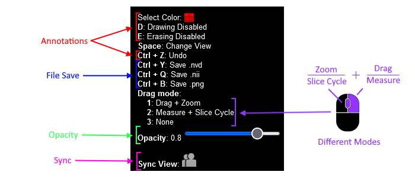

## Overview
### <a href="https://oopsuwu.github.io/Collaborative-Segmentation-Software/">Collaborative Segmentation Software</a>
A browser-based online annotation tool for 3D medical image volumes that allow annotations to be shared between users. The sharing feature allows images to be viewed across multiple users concurrently, and can sync viewing perspectives and drawings. For a shared viewing experience, changes made to a volume/image are updated automatically when a drawing is finished or a slice is changed. 

The software utilizes Pusher, which eliminates the need for a server to handle real-time functionality.

[Website](https://oopsuwu.github.io/Collaborative-Segmentation-Software/)

[Documentation](https://docs.google.com/document/d/1Uaem2g6G0NlGJlJqjM-i8PanefAxztO0YBLZMPwWLlQ/edit?usp=sharing)

## Technologies
- [NiiVue](https://github.com/niivue/niivue)
- [Pusher](https://pusher.com/)

## Features
The software contains 3 types of synchronization features for easy collaboration:
- Annotation Sync  
  
- Perspective View Sync  
  
- Slice View Sync  
  
- Simple UI  
  

## Loading Medical Volumes

- Drag and drop the [supported image](#supported-images) from your local drive into the website
  - Works with .drawing.nvd file saved after annotating
- Upload file through URL
  - Parameter 'data' takes a URL of the [supported image](#supported-images)
  - A default image is loaded if no file is found in the URL
  - Type '?data=' after the URL from our website, then paste the link of a medical file
  - Examples
    - https://oopsuwu.github.io/Collaborative-Segmentation-Software/?data=https://oopsuwu.github.io/Collaborative-Segmentation-Software//samples/FLAIR.nii.gz
    - https://oopsuwu.github.io/Collaborative-Segmentation-Software/?data=https://niivue.github.io/niivue-demo-images/visiblehuman.nii.gz

## Settings & Controls

| Functions      | Description                                                                  |
|----------------|------------------------------------------------------------------------------|
| Select Color   | Changes the color of the pen used to draw annotations                        |
| Toggle Drawing | Enables and disables the use of the pen                                      |
| Toggle Erasing | Enables and disables the use of the eraser                                   |
| Change View    | Changes the canvas to display different perspectives of the 3D medical image |
| Undo           | Removes the latest annotation created                                        |
| Save .nvd      | Saves the medical image with annotations, can be uploaded to re-annotate     |
| Save .nii      | Saves the annotations only                                                   |
| Save .png      | Saves the current image slice with annotations                               |
| Opacity Slider | Changes opacity of the annotations: 0 - Clear, 1 - Opaque                    |
| Slice Cycle    | Changes the canvas to display different slices of the 3D medical image       |
| Zoom           | Move closer or further from the canvas                                       |
| Measure        | Measures length from the starting to ending point with units in millimeters  |
| Sync View      | Enables and disables both annotation and image view sync                     |

## Supported Images
| Formats      | File Type                                                                                                                 |
|--------------|---------------------------------------------------------------------------------------------------------------------------|
| Voxel        | NIfTI, NRRD, MRtrix MIF, AFNI HEAD/BRIK, MGH/MGZ, ITK MHD, ECAT7                                                          |
| Mesh         | GIfTI, ASC, BrainSuite DFS, PLY, BrainNet NV, BrainVoyager SRF, FreeSurfer, MZ3, OFF, Wavefront OBJ, STL, Legacy VTK, X3D |
| Mesh Overlay | GIfTI, CIfTI-2, MZ3, SMP, STC, FreeSurfer (CURV/ANNOT)                                                                    |
| Tractography | TCK, TRK, TRX, VTK, AFNI .niml.tract                                                                                      |
| DICOM        | DICOM, DICOM Manifests                                                                                                    |

    
  

